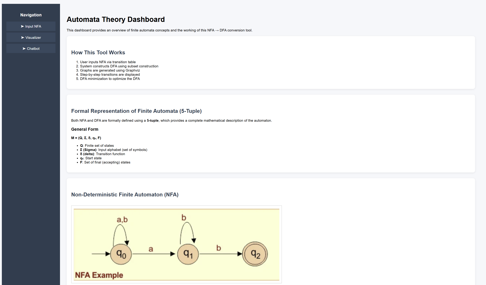
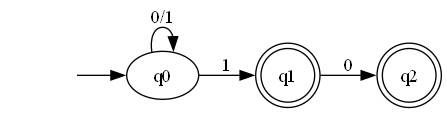
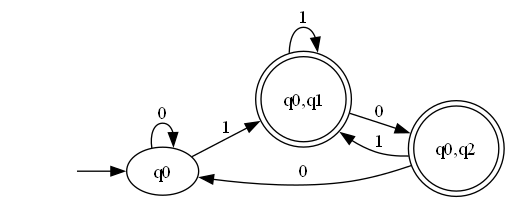
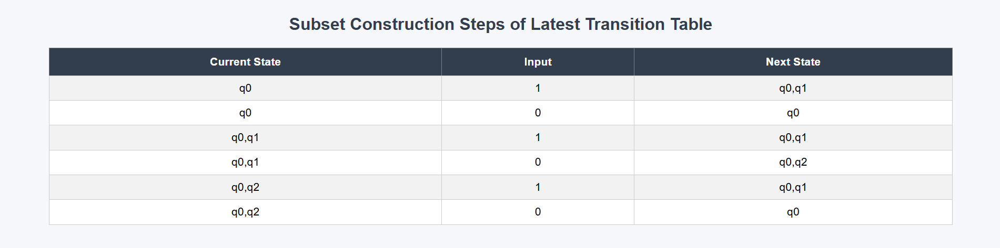

# NFA to DFA Converter (Web Application)

A web-based tool that converts a **Non-deterministic Finite Automaton
(NFA)** into its equivalent **Deterministic Finite Automaton (DFA)**
using the **Subset Construction Algorithm**.

The application allows users to input an NFA through a simple interface
and automatically generates:

-   The **equivalen NFA transition table**  
-   The **equivalent DFA transition table**
-   **Step-by-step subset construction process**
-   **Graphical visualization of both NFA and DFA**
-   An **interactive chatbot assistant** that explains concepts related
    to NFAs, DFAs, and automata theory.

The project is implemented using **Python (Flask)** for the backend and
**HTML/CSS** for the frontend.

Deployed on Render: https://nfa-to-dfa-visualizer.onrender.com

------------------------------------------------------------------------

# Features

-   Convert any valid **NFA to DFA**
-   Displays **subset construction steps**
-   Generates **visual graphs** for NFA and DFA
-   Simple **web interface for input**
-   Handles **multiple transitions and empty states**
-   **Integrated AI chatbot** that can explain:
    -   NFA and DFA basics
    -   Subset construction algorithm
    -   Automata theory concepts

------------------------------------------------------------------------

# Demo

## Input Interface

Users enter the components of an NFA including states, alphabet, start
state, final states, and transitions.

Example input:

States: q0,q1,q2\
Alphabet: 0,1\
Start: q0\
Final: q2

Transitions:

q0 0 q0,q1\
q0 1 q0\
q1 1 q2

Screenshot:



------------------------------------------------------------------------

## Generated NFA Graph

The application visualizes the **input NFA** using Graphviz.



------------------------------------------------------------------------

## Generated DFA Graph

The equivalent DFA is generated automatically using the **Subset
Construction Algorithm**.



------------------------------------------------------------------------

## Subset Construction Steps

The tool also displays the **step-by-step DFA construction process**.



------------------------------------------------------------------------

# AI Chatbot Assistant

The project includes a **chatbot powered by the Gemini API** that helps
users understand automata theory concepts.

Users can ask questions such as:

-   "What is the difference between NFA and DFA?"
-   "Explain subset construction."
-   "How does NFA to DFA conversion work?"
-   "What are epsilon transitions?"

The chatbot provides **interactive explanations**, making the tool both **educational and practical**.

------------------------------------------------------------------------
# Project Structure
```
project-root/
│
├── backend/
│   ├── app.py              # Main Flask application (routes + orchestration)
│   ├── converter.py        # NFA → DFA conversion logic (subset construction)
│   ├── visualize.py        # Graphviz-based NFA & DFA visualization
│   ├── chatbot.py          # Gemini API integration for chatbot
│
├── frontend/
│   ├── templates/          # HTML templates (Jinja2)
│   │   ├── index.html      # Input form for NFA
│   │   ├── dashboard.html  # Main dashboard UI
│   │   ├── results.html    # Visualization & steps display
│   │   └── chatbot.html    # Chatbot interface
│   │
│   └── static/              # Static assets
│   │    ├── css/            # Stylesheets
│   │    ├── nfa.png         # Generated NFA graph
│   │    └── dfa.png         # Generated DFA graph
|   │
|   └── screenshots/         # Images for README.md
├── .gitignore
├── requirements.txt        # Python dependencies
└── README.md               # Project documentation

```
  

------------------------------------------------------------------------

# How It Works

1.  The user inputs the **NFA components**:

    -   States
    -   Alphabet
    -   Start state
    -   Final states
    -   Transitions

2.  The backend parses the input and sends it to the **subset
    construction algorithm** implemented in `converter.py`.

3.  The algorithm builds DFA states as **sets of NFA states**.

4.  Graphs for the **NFA and DFA** are generated using **Graphviz**.

5.  The chatbot module (`chatbot.py`) connects to the **Gemini API** to
    provide explanations for automata concepts.

6.  The results page displays:

    -   The NFA graph
    -   The DFA graph
    -   Step-by-step subset construction table

------------------------------------------------------------------------

# Input Format


## Start State

Example:

    q0

## Final States

Example:

    q2

## Transitions

One transition per line:

    state symbol next_states

Example:

    q0 0 q0,q1
    q0 1 q0
    q1 1 q2

------------------------------------------------------------------------

# Installation

## 1. Clone the repository

    git clone https://github.com/yourusername/nfa_to_dfa_visualizer.git
    cd nfa_to_dfa_visualizer

## 2. Install dependencies

    pip install -r requirements.txt

You must also install **Graphviz** on your system.

Ubuntu:

    sudo apt install graphviz

Windows:

Download from https://graphviz.org/download/

------------------------------------------------------------------------

# Configure Gemini API

Create an API key from **Google AI Studio**.

Set it in your environment.

Create a `.env` file:

GEMINI_API_KEY=your_api_key

------------------------------------------------------------------------

# Running the Application

    python app.py

Open your browser and go to:

    http://127.0.0.1:5000/

------------------------------------------------------------------------

# Technologies Used

-   Python
-   Flask
-   Graphviz
-   Gemini API
-   HTML
-   CSS

------------------------------------------------------------------------

# Algorithm Used

The project implements the **Subset Construction Algorithm** to convert
an **NFA into an equivalent DFA**.

Key idea: Each **DFA state represents a set of NFA states**.

Steps:

1.  Start with the start state
2.  Compute reachable states for each symbol
3.  Create new DFA states if not already discovered
4.  Continue until no new states appear

------------------------------------------------------------------------

# Author

**Pulkit Gupta**\
2024UCM4018\
Semester 4, Mathematics and Computing\
NSUT, Dwarka
